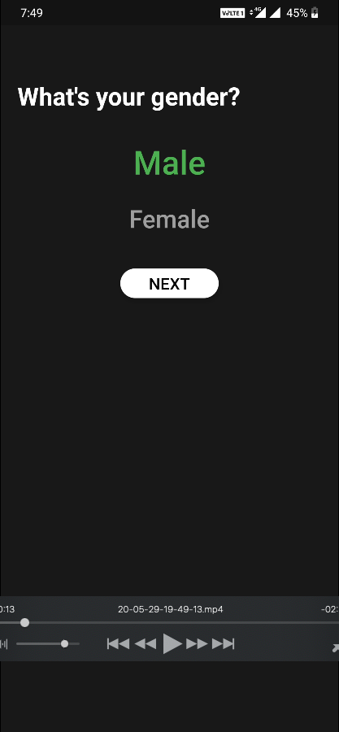
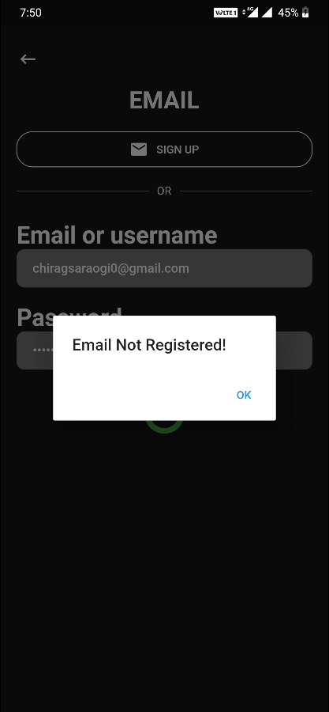

# firebaseauthenticationsystem

# Firebase Authentication

Now no hassle each time you want to create a new project and include a working login module(with Google/Phone OTP/Email) with user data stored in Firestore

Platform-Independent Configuration(Do for both ios and android)
Just configure Firebase console for each sign in method Phone, Email, Google and for Cloud Firestore
Download your own google-services.json and GoogleService-Info.plist file, place them in their respective required directories using Android Studio and Xcode
Only IOS Configuration
For Phone Authentication in iOS Select the runner file and Goto Signing and Capabilities tab. Add Push Notification capability using the + button
Goto Info tab of your runner file and add using the + button in the Url Types menu In URL Schemes add your Reverse Client ID that is present in the GoogleService-Info.Plist file and close the tab.
You're all set to run the Authentication module with amazing UI on both IOS and ANDROID.

## Features

* [x] Android (iOS Coming Soon)

  * [x] Google Sign in
  * [x] Phone OTP Sign in
  * [x] OTP Auto-Retrieval
  * [x] Email Sign in
  * [x] User Model Storage for basic user details in Firestore
  * [x] Clean UI and Implementation
  * [x] Developer- friendly consistent state management and architecture with Multi Providers

* Supported formats

  * Android
  * iOS

### Show some :heart: and star the repo to support the project

### Screenshots

    
    
    

# Pull Requests

I welcome and encourage all pull requests. It usually will take me within 24-48 hours to respond to any issue or request. Here are some basic rules to follow to ensure timely addition of your request:

1.  Match coding style (braces, spacing, etc.) This is best achieved using `Reformat Code` feature of Android Studio `CMD`+`Option`+`L` on Mac and `CTRL` + `ALT` + `L` on Linux + Windows .
2.  If its a feature, bugfix, or anything please only change code to what you specify.
3.  Please keep PR titles easy to read and descriptive of changes, this will make them easier to merge :)
4.  Pull requests _must_ be made against `develop` branch. Any other branch (unless specified by the maintainers) will get rejected.
5.  Check for existing [issues](https://github.com/chirag10k/Expense-Budget-Tracker/issues) first, before filing an issue.
6.  Make sure you follow the set standard as all other projects in this repo do
7.  Have fun!

### Created & Maintained By

([Chirag Saraogi](https://github.com/chirag10k)) ([Twitter](https://twitter.com/ChiragSaraogi)) ([Instagram](https://www.instagram.com/chirag_c.s/))

> If you found this project helpful or you learned something from the source code and want to thank me, consider buying me a cup of :coffee:
>
> * [PayPal](https://paypal.me/chirag10k)

# License

     Copyright [2020] [Chirag Saraogi]

   Licensed under the Apache License, Version 2.0 (the "License");
   you may not use this file except in compliance with the License.
   You may obtain a copy of the License at

       http://www.apache.org/licenses/LICENSE-2.0

   Unless required by applicable law or agreed to in writing, software
   distributed under the License is distributed on an "AS IS" BASIS,
   WITHOUT WARRANTIES OR CONDITIONS OF ANY KIND, either express or implied.
   See the License for the specific language governing permissions and
   limitations under the License.

## Getting Started

This project is a starting point for a Flutter application.

A few resources to get you started if this is your first Flutter project:

- [Lab: Write your first Flutter app](https://flutter.dev/docs/get-started/codelab)
- [Cookbook: Useful Flutter samples](https://flutter.dev/docs/cookbook)

For help getting started with Flutter, view our
[online documentation](https://flutter.dev/docs), which offers tutorials,
samples, guidance on mobile development, and a full API reference.

## Getting Started

This project is a starting point for a Flutter application.

A few resources to get you started if this is your first Flutter project:

- [Lab: Write your first Flutter app](https://flutter.dev/docs/get-started/codelab)
- [Cookbook: Useful Flutter samples](https://flutter.dev/docs/cookbook)

For help getting started with Flutter, view our
[online documentation](https://flutter.dev/docs), which offers tutorials,
samples, guidance on mobile development, and a full API reference.
